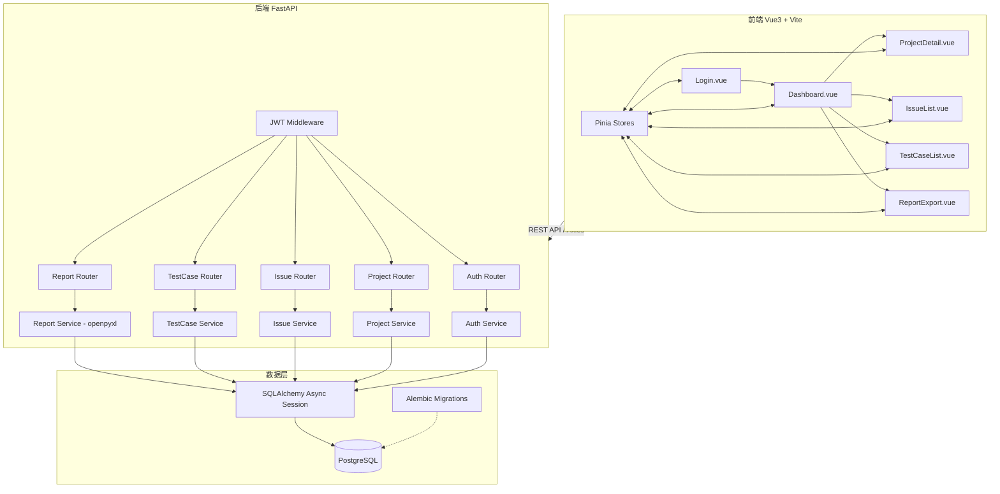

## 产品概述

一个标准测试流程管理系统，用于测试团队进行项目测试工作的全流程管理，包括项目资料下载、问题记录管理、测试用例管理以及报表汇总导出功能。

## 核心功能

- **用户登录与权限管理**：支持管理员和普通用户两种角色登录，不同角色拥有不同的操作权限
- **项目管理**：登录后选择对应项目，查看并下载该项目的原理图和相关图片资料
- **问题记录管理**：展示历史问题记录汇总列表，支持新建、编辑、删除问题记录
- **测试用例管理**：展示历史测试用例和测试问题记录汇总，支持创建新的测试用例
- **报表导出**：将问题记录和测试用例记录汇总后导出为Excel表格文件

## 用户角色权限

- **管理员**：用户管理、项目管理、所有数据的增删改查、报表导出
- **普通用户**：查看分配的项目、下载项目资料、创建/编辑自己的问题记录和测试用例、导出报表

## 技术栈选型

| 层级 | 技术选型 | 说明 |
| --- | --- | --- |
| 前端框架 | Vue 3 + TypeScript | 现代化响应式框架，组合式API |
| UI组件库 | Element Plus | 企业级Vue3组件库，表格/表单丰富 |
| 构建工具 | Vite | 快速构建和热更新 |
| 状态管理 | Pinia | Vue3官方推荐状态管理 |
| 后端框架 | **Python FastAPI** | 高性能异步RESTful API框架，自动生成OpenAPI文档 |
| 数据库 | **PostgreSQL 16** | 功能强大的开源关系型数据库，支持JSONB等高级特性 |
| ORM | **SQLAlchemy 2.0 (async)** | Python成熟ORM框架，支持async/await异步引擎 |
| 数据库驱动 | **asyncpg + psycopg** | 高性能PostgreSQL异步驱动 |
| 文件存储 | 本地文件系统 / **python-multipart + aiofiles** | 项目资料的异步上传和下载 |
| Excel导出 | **openpyxl / xlsxwriter** | Python服务端生成Excel文件 |
| 认证 | **JWT (python-jose)** | 无状态身份验证，支持RS256/HS256 |
| 密码加密 | **passlib[bcrypt]** | 安全的密码哈希处理 |
| 数据校验 | **Pydantic v2** | FastAPI原生集成的数据校验和序列化 |
| CORS | **fastapi.middleware.cors** | 跨域请求支持 |
| Alembic | **Alembic** | 数据库迁移管理工具 |


## 实现方案

采用前后端分离架构，前端Vue3单页应用通过RESTful API与Python FastAPI后端通信。系统按模块划分为认证模块、项目模块、问题记录模块、测试用例模块和报表模块。

### 核心技术决策

1. **FastAPI + SQLAlchemy 2.0 async**：利用Python async/await实现高并发API处理，SQLAlchemy 2.0的异步引擎配合asyncpg驱动提供卓越的数据库IO性能；FastAPI自动生成Swagger/OpenAPI文档便于前后端联调
2. **Pydantic v2 全局数据校验**：请求/响应模型统一使用Pydantic BaseModel定义，实现类型安全的序列化和校验，与FastAPI深度集成
3. **JWT Token认证（python-jose）**：无状态设计适合前后端分离架构，Token存储在localStorage，使用python-jose处理JWT编解码
4. **python-multipart + UploadFile**：FastAPI内置的文件上传能力，配合aiofiles实现异步文件写入，处理项目资料（原理图/图片）
5. **openpyxl服务端Excel生成**：支持样式设置、合并单元格、条件格式等高级功能，满足复杂报表需求
6. **Element Plus**：提供完整的Table、Form、Dialog、Upload等企业级Vue3组件
7. **Alembic数据库迁移**：版本化管理数据库Schema变更，支持升级和回滚操作

### 数据库核心表设计（PostgreSQL DDL）

```sql
-- users: 用户表(id SERIAL PRIMARY KEY, username VARCHAR(50) UNIQUE NOT NULL, password_hash VARCHAR(255) NOT NULL, role VARCHAR(20) DEFAULT 'user', created_at TIMESTAMPTZ DEFAULT NOW())
-- projects: 项目表(id SERIAL PRIMARY KEY, name VARCHAR(100) NOT NULL, description TEXT, created_by INTEGER FK->users(id), created_at TIMESTAMPTZ DEFAULT NOW())
-- project_files: 项目资料表(id SERIAL PRIMARY KEY, project_id INTEGER FK->projects(id), file_name VARCHAR(255) NOT NULL, file_path VARCHAR(500) NOT NULL, file_type VARCHAR(50), file_size INTEGER, uploaded_by INTEGER FK->users(id), created_at TIMESTAMPTZ DEFAULT NOW())
-- issues: 问题记录表(id SERIAL PRIMARY KEY, project_id INTEGER FK->projects(id), reporter_id INTEGER FK->users(id), title VARCHAR(200) NOT NULL, description TEXT, status VARCHAR(20) DEFAULT 'new', priority VARCHAR(10) DEFAULT 'medium', created_at TIMESTAMPTZ DEFAULT NOW(), updated_at TIMESTAMPTZ)
-- test_cases: 测试用例表(id SERIAL PRIMARY KEY, project_id INTEGER FK->projects(id), author_id INTEGER FK->users(id), title VARCHAR(200) NOT NULL, steps JSONB NOT NULL, expected_result TEXT, actual_result TEXT, status VARCHAR(20) DEFAULT 'draft', created_at TIMESTAMPTZ DEFAULT NOW(), updated_at TIMESTAMPTZ)
-- test_case_steps: 测试步骤表(id SERIAL PRIMARY KEY, test_case_id INTEGER FK->test_cases(id), step_order INTEGER NOT NULL, action_description TEXT NOT NULL, expected_result TEXT, actual_result TEXT, status VARCHAR(20))
```

> 注意：steps字段使用PostgreSQL的JSONB类型存储动态步骤列表，灵活适配不同数量的测试步骤

### 系统架构图



## 目录结构

```
c:/Users/Admin/CodeBuddy/20260702111203/
├── client/                          # 前端Vue3项目 [NEW]
│   ├── src/
│   │   ├── api/                     # API请求封装
│   │   │   ├── request.ts           # Axios实例和拦截器
│   │   │   ├── auth.ts              # 认证相关API
│   │   │   ├── project.ts           # 项目相关API
│   │   │   ├── issue.ts             # 问题记录API
│   │   │   ├── testCase.ts          # 测试用例API
│   │   │   └── report.ts            # 报表导出API
│   │   ├── views/                   # 页面视图
│   │   │   ├── Login.vue            # 登录页面
│   │   │   ├── Dashboard.vue        # 首页仪表盘
│   │   │   ├── ProjectSelect.vue    # 项目选择页
│   │   │   ├── ProjectDetail.vue    # 项目详情+资料下载
│   │   │   ├── IssueList.vue        # 问题记录列表
│   │   │   ├── IssueForm.vue        # 新建/编辑问题记录
│   │   │   ├── TestCaseList.vue     # 测试用例列表
│   │   │   ├── TestCaseForm.vue     # 新建/测试用例
│   │   │   └── ReportExport.vue     # 报表汇总导出
│   │   ├── components/              # 公共组件
│   │   │   ├── AppHeader.vue       # 顶部导航栏
│   │   │   ├── AppSidebar.vue      # 侧边菜单栏
│   │   │   ├── FileDownload.vue    # 文件下载组件
│   │   │   └── DataTable.vue       # 通用数据表格
│   │   ├── stores/                  # Pinia状态管理
│   │   │   ├── user.ts             # 用户状态
│   │   │   ├── project.ts          # 项目状态
│   │   │   └── app.ts              # 应用全局状态
│   │   ├── router/                 # Vue Router路由
│   │   │   └── index.ts
│   │   ├── types/                  # TypeScript类型定义
│   │   │   ├── user.d.ts
│   │   │   ├── project.d.ts
│   │   │   ├── issue.d.ts
│   │   │   └── testCase.d.ts
│   │   ├── utils/                  # 工具函数
│   │   │   └── index.ts
│   │   ├── App.vue
│   │   └── main.ts
│   ├── package.json
│   ├── vite.config.ts
│   └── tsconfig.json
├── server/                          # 后端FastAPI项目 [NEW]
│   ├── app.py                       # FastAPI应用入口，包含CORS配置、路由注册、生命周期
│   ├── main.py                      # uvicorn启动入口
│   ├── config.py                    # 配置管理（数据库连接、JWT密钥、文件上传路径等）
│   ├── requirements.txt             # Python依赖清单
│   ├── alembic.ini                  # Alembic迁移配置
│   ├── uploads/                     # 上传文件存储目录 [NEW]
│   ├── api/                         # 路由层（FastAPI APIRouter）
│   │   ├── __init__.py
│   │   ├── deps.py                  # 公共依赖注入（获取db session、获取当前用户）
│   │   ├── auth.py                  # 认证路由（/api/auth/login, /api/auth/me）
│   │   ├── projects.py              # 项目路由（/api/projects/*）
│   │   ├── issues.py                # 问题记录路由（/api/issues/*）
│   │   ├── test_cases.py            # 测试用例路由（/api/test-cases/*）
│   │   └── reports.py               # 报表导出路由（/api/reports/export）
│   ├── schemas/                     # Pydantic数据模型（请求/响应DTO）
│   │   ├── __init__.py
│   │   ├── user.py                  # UserCreate, UserResponse, Token
│   │   ├── project.py               # ProjectCreate, ProjectResponse
│   │   ├── issue.py                 # IssueCreate, IssueUpdate, IssueResponse
│   │   ├── test_case.py             # TestCaseCreate, TestCaseStep, TestCaseResponse
│   │   └── report.py                # ExportRequest, ExportResponse
│   ├── models/                      # SQLAlchemy ORM模型
│   │   ├── __init__.py
│   │   ├── database.py              # 异步引擎、SessionLocal、Base声明
│   │   ├── user.py                  # User模型
│   │   ├── project.py               # Project模型
│   │   ├── project_file.py          # ProjectFile模型
│   │   ├── issue.py                 # Issue模型
│   │   └── test_case.py             # TestCase模型 + TestCaseStep模型
│   ├── services/                    # 业务逻辑层
│   │   ├── __init__.py
│   │   ├── auth_service.py          # 登录认证、密码哈希验证、Token生成
│   │   ├── project_service.py       # 项目CRUD、文件上传下载
│   │   ├── issue_service.py         # 问题记录CRUD、状态流转
│   │   ├── testcase_service.py      # 测试用例CRUD、步骤管理
│   │   └── report_service.py        # Excel报表生成逻辑
│   ├── middleware/                  # 中间件
│   │   ├── __init__.py
│   │   ├── auth.py                  # JWT认证中间件（Depends可调用对象）
│   │   └── role.py                  # 角色权限中间件（require_admin等）
│   ├── utils/                       # 工具函数
│   │   ├── __init__.py
│   │   ├── excel_generator.py       # openpyxl Excel生成封装
│   │   └── file_utils.py            # 文件操作工具（校验类型大小、打包下载）
│   └── alembic/                     # Alembic数据库迁移
│       ├── env.py
│       ├── versions/
│       └── script.py.mako
├── database/                        # 数据库初始化脚本 [NEW]
│   └── init.sql                     # PostgreSQL初始建表脚本（备选方案）
└── README.md                        # 项目说明文档 [NEW]
```

## 关键实现说明

### 性能相关

1. **异步全链路**：FastAPI路由 -> SQLAlchemy async session -> asyncpg驱动，全异步IO避免阻塞
2. **分页查询**：所有列表接口使用offset/limit分页 + count总数，避免全量加载
3. **连接池**：SQLAlchemy async engine配置pool_size=10, max_overflow=20的连接池
4. **前端虚拟滚动**：大数据量表格使用虚拟滚动优化渲染性能

### 安全性

1. **密码加密**：passlib[bcrypt]加盐哈希，rounds=12
2. **JWT机制**：HS256签名，Access Token有效期2小时，Refresh Token可选7天
3. **输入校验**：Pydantic v2严格类型校验所有API输入
4. **文件安全**：白名单限制上传类型（jpg/png/gif/pdf/svg/dwg），单文件最大10MB
5. **SQL注入防护**：SQLAlchemy参数化查询天然防注入

### 文件下载

1. **流式传输**：aiofiles读取文件，StreamingResponse流式返回
2. **批量打包**：多选文件使用zipfile内存打包后返回zip下载

### Excel导出（openpyxl）

1. **双Sheet结构**：Sheet1为问题记录汇总，Sheet2为测试用例汇总
2. **样式美化**：表头加粗背景色、边框、自适应列宽、条件格式标记状态
3. **筛选器**：支持按项目ID、时间范围、状态过滤数据后导出

## 设计风格概述

采用现代企业级管理后台设计风格（Enterprise Dashboard），以清晰的功能导向为核心，配合专业的视觉呈现。整体界面布局为经典的后台管理模式：**左侧固定导航菜单 + 右侧内容区域**，顶部包含面包屑导航和用户信息栏。界面注重信息层次分明，操作流程清晰直观，配色专业稳重，适合测试管理场景的日常使用。融入卡片式布局和数据驱动的视觉语言，通过微妙的渐变、圆角阴影和过渡动画提升品质感，同时保持专业严谨的整体调性。

## 页面规划（6个核心页面）

### 页面1：登录页面（Login.vue）

**整体布局**：全屏渐变背景（深蓝到藏青色），居中白色毛玻璃效果登录卡片

**区块划分**：

- **品牌区域**：顶部系统Logo图标 + "标准测试流程管理系统" 标题 + 副标题描述
- **登录表单区**：用户名输入框（带用户图标前缀）、密码输入框（带锁定图标前缀，支持显示/隐藏切换）、角色下拉选择框（可选记住我复选框）、登录按钮（主色调渐变，hover有微上浮动效）
- **底部信息栏**：版权信息 + 版本号

### 页面2：项目工作台首页（Dashboard.vue）

**整体布局**：顶栏固定 + 左侧折叠菜单 + 右侧内容区

**区块划分**：

- **统计卡片区**：4个统计卡片横排展示（参与项目数、待处理问题数、测试用例完成率、本周新增记录数），每张卡片含数字动画计数效果和趋势箭头
- **我的项目网格区**：以响应式卡片网格形式展示已参与项目，每张卡片含项目名称、描述摘要、负责人头像、文件数量标签、进入按钮（hover时卡片微抬升+阴影加深）
- **最近动态时间线**：右侧或下方时间线组件，展示最近的问题记录和测试用例更新动态，含用户头像、操作类型标签颜色区分
- **快捷操作入口**：底部浮动快捷按钮组（新建问题记录、新建测试用例、导出报表）

### 页面3：项目详情与资料中心（ProjectDetail.vue）

**整体布局**：继承主框架，内容区域分为上下两部分

**区块划分**：

- **项目基本信息头部区**：大号项目名称 + 描述文字 + 元信息行（创建时间/负责人/成员数），背景使用浅色渐变分隔
- **资料文件列表主体区**：
- 工具栏：搜索框 + 文件类型筛选下拉 + 批量下载按钮 + 上传新资料按钮（管理员可见）
- 文件表格：文件名（带类型图标）、文件类型标签（彩色badge）、文件大小、上传者、上传时间、操作列（预览/下载）
- 图片类文件在表格中直接显示缩略图预览
- **空状态引导**：无资料时显示上传引导插画 + 拖拽上传区域

### 页面4：问题记录管理中心（IssueList.vue）

**整体布局**：左侧固定宽度筛选面板 + 右侧弹性数据区域

**区块划分**：

- **左侧筛选面板**：
- 状态筛选组（新建/处理中/已解决/已关闭）带计数标签
- 优先级筛选（高/中/低）彩色标签
- 时间范围选择器
- 所属项目选择
- 重置筛选按钮
- **顶部操作栏**：搜索框（实时模糊搜索） + 新建问题按钮 + 批量操作下拉（批量关闭/批量分配）
- **主数据表格**：展示问题ID（可点击复制）、标题（超链接点击展开详情）、所属项目标签、负责人头像+姓名、状态徽章（颜色编码）、优先级旗帜图标、创建时间相对格式
- **新建/编辑弹窗（Dialog）**：表单含标题输入、描述富文本区（markdown编辑器简化版）、优先级选择、状态流转下拉、附件上传区域、保存/取消按钮

### 页面5：测试用例管理中心（TestCaseList.vue）

**整体布局**：同问题记录页保持一致的操作体验和布局结构

**区块划分**：

- **左侧筛选面板**：执行状态（通过/失败/未执行/阻塞）、所属项目、时间范围
- **顶部操作栏**：搜索 + 新建测试用例 + 批量执行结果录入
- **测试用例表格**：额外展示列 —— 执行步骤数（数字badge）、通过率进度条、最后执行时间、实际结果摘要
- **测试用例弹窗（Dialog + Tabs）**：
- 基本信息 Tab：标题、前置条件描述、优先级
- 测试步骤 Tab：动态步骤列表，每步含序号、操作描述、预期结果；支持增删步骤按钮；每步可独立录入实际结果和通过/失败判定
- **页脚统计栏**：当前筛选条件下总用例数、通过率百分比、失败数警告提示

### 页面6：报表汇总导出（ReportExport.vue）

**整体布局**：宽幅内容区，居中的导出配置卡片

**区块划分**：

- **导出配置面板**：
- 项目范围选择（多选下拉 / 全部项目选项）
- 时间范围选择器（快速选择：近一周/近一月/近三月/自定义区间）
- 数据类型勾选组（问题记录 / 测试用例 / 全部）
- 导出格式确认（Excel .xlsx标识）
- **数据预览区域**：实时预览将要导出的数据概览表格（只读，前10条采样），含记录总数统计
- **操作按钮区**：生成并下载按钮（主色调，带loading状态）+ 清空重置按钮
- **历史导出记录列表**（下方可折叠区）：展示过去的导出记录（文件名、导出时间、数据条数、重新下载链接）

## Agent Extensions

### Skill

- **xlsx**
- Purpose: 用于系统第4步的Excel报表导出功能开发和测试验证
- Expected outcome: 使用 openpyxl 在 FastAPI 后端实现问题记录和测试用例记录的Excel格式化导出，支持自定义样式、多工作表(Sheet)、数据筛选、条件格式等功能