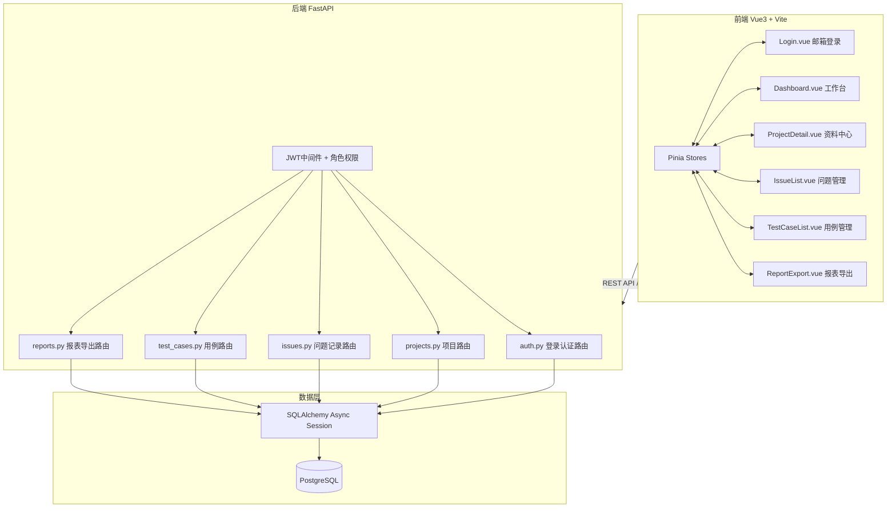

## 产品概述

一个标准测试流程管理系统，用于测试团队进行项目测试工作的全流程管理。系统采用前后端分离架构，前端为 Vue3 单页应用，后端为 Python FastAPI RESTful API 服务。

## 核心功能

### 功能模块一：人员登录与项目选择

- 用户通过**邮箱 + 密码**登录系统（JWT Token 认证）
- 登录后从项目列表中选择当前工作项目
- 查看并下载该项目关联的原理图和相关图片资料（支持单个/批量下载）

### 功能模块二：问题记录管理

- 展示所选项目的**历史问题记录汇总列表**（支持按状态、优先级、时间筛选）
- **新建问题记录**界面：填写标题、描述、优先级、附件等
- 编辑/删除/状态流转操作（新建 → 处理中 → 已解决 → 已关闭）

### 功能模块三：测试用例管理

- 展示历史测试用例和测试问题记录汇总
- **新建测试用例**界面：包含动态步骤表单（步骤可增删，每步含操作描述和预期结果）
- 测试结果录入（通过/失败/未执行/阻塞）及通过率统计

### 功能模块四：报表汇总导出

- 按项目和时间范围筛选数据
- 将问题记录和测试用例记录**汇总导出为 Excel 表格**（多工作表，带样式格式化）

## 用户角色权限

- **管理员**：用户管理、项目管理、所有数据的增删改查、报表导出
- **普通用户**：查看分配的项目、下载项目资料、创建/编辑自己的问题记录和测试用例、导出报表

## 技术栈选型

| 层级 | 技术选型 | 说明 |
| --- | --- | --- |
| 前端框架 | Vue 3 + TypeScript | 现代化响应式框架，组合式 API |
| UI 组件库 | Element Plus | 企业级 Vue3 组件库 |
| 构建工具 | Vite 5 | 快速构建和热更新 |
| 样式方案 | TailwindCSS 3.4 | 原子化 CSS，配合 Element Plus 使用 |
| 状态管理 | Pinia | Vue3 官方推荐状态管理 |
| HTTP 客户端 | Axios | API 请求封装 |
| 图标库 | lucide-vue-next | 轻量级图标库 |
| 后端框架 | **Python FastAPI** | 高性能异步 RESTful API，自动生成 OpenAPI 文档 |
| 数据库 | **PostgreSQL 16** | 关系型数据库，支持 JSONB 高级特性 |
| ORM | **SQLAlchemy 2.0 (async)** | 异步 ORM，配合 asyncpg 驱动 |
| 数据校验 | **Pydantic v2** | FastAPI 原生集成的请求/响应模型校验 |
| 认证方案 | **JWT (python-jose)** | 邮箱+密码登录，HS256 签名 |
| 密码加密 | **passlib[bcrypt]** | bcrypt 加盐哈希 |
| 文件上传 | python-multipart + aiofiles | 异步文件上传下载 |
| Excel 导出 | **openpyxl** | Python 端生成格式化 Excel 文件 |
| 数据库迁移 | Alembic | Schema 版本管理 |


## 实现方案

### 架构设计

采用经典的前后端分离架构：

```
前端(Vue3 SPA) ←→ RESTful API ←→ FastAPI 后端服务 ←→ PostgreSQL 数据库
```

FastAPI 采用分层架构：路由层(api/) → 控制器/服务层(services/) → 数据层(models/)，中间件(middleware/)处理认证和权限。Pydantic schemas 统一定义请求/响应 DTO。

### 核心技术决策

1. **邮箱认证体系**：用户表以 email 为主标识字段（VARCHAR(255) UNIQUE NOT NULL），登录接口接收 email + password，使用 passlib[bcrypt] 验证密码哈希，python-jose 生成/验证 JWT Token
2. **SQLAlchemy 2.0 异步全链路**：FastAPI async 路由 → AsyncSession → asyncpg 驱动，全程无阻塞 IO；连接池配置 pool_size=10, max_overflow=20
3. **JSONB 动态步骤存储**：测试用例的执行步骤使用 PostgreSQL JSONB 类型存储，灵活适配不同数量的测试步骤，支持结构化查询
4. **openpyxl 双 Sheet 导出**：Sheet1 问题记录汇总 + Sheet2 测试用例汇总，含样式美化（表头加粗背景色、边框、自适应列宽、条件格式标记状态）
5. **文件流式传输**：aiofiles 异步读取 + StreamingResponse 流式返回，批量下载使用 zipfile 内存打包
6. **Element Plus + TailwindCSS 混合方案**：Element Plus 提供业务组件（Table/Form/Dialog/Upload），TailwindCSS 处理布局和自定义样式微调

### 数据库核心表设计

```sql
-- users: 用户表(id SERIAL PK, email VARCHAR(255) UNIQUE NOT NULL, password_hash VARCHAR(255) NOT NULL, display_name VARCHAR(50), role VARCHAR(20) DEFAULT 'user', created_at TIMESTAMPTZ)
-- projects: 项目表(id SERIAL PK, name VARCHAR(100) NOT NULL, description TEXT, created_by INTEGER FK->users(id), created_at TIMESTAMPTZ)
-- project_files: 项目资料表(id SERIAL PK, project_id INTEGER FK->projects(id), file_name VARCHAR(255), file_path VARCHAR(500), file_type VARCHAR(50), file_size INTEGER, uploaded_by FK->users(id), created_at TIMESTAMPTZ)
-- issues: 问题记录表(id SERIAL PK, project_id FK->projects(id), reporter_id FK->users(id), title VARCHAR(200), description TEXT, status VARCHAR(20) DEFAULT 'new', priority VARCHAR(10) DEFAULT 'medium', created_at TIMESTAMPTZ, updated_at TIMESTAMPTZ)
-- test_cases: 测试用例表(id SERIAL PK, project_id FK->projects(id), author_id FK->users(id), title VARCHAR(200), pre_condition TEXT, steps JSONB NOT NULL DEFAULT '[]', expected_result TEXT, actual_result TEXT, status VARCHAR(20) DEFAULT 'draft', created_at TIMESTAMPTZ, updated_at TIMESTAMPTZ)
```

### 系统架构图



## 目录结构

```
c:/Users/Admin/CodeBuddy/20260702111203/
├── client/                              # [NEW] 前端 Vue3 项目
│   ├── src/
│   │   ├── api/
│   │   │   ├── request.ts              # Axios 实例和拦截器（Token 注入）
│   │   │   ├── auth.ts                 # 登录/获取用户信息 API
│   │   │   ├── project.ts              # 项目 CRUD 和资料 API
│   │   │   ├── issue.ts                # 问题记录 CRUD API
│   │   │   ├── testCase.ts             # 测试用例 CRUD API
│   │   │   └── report.ts               # 报表导出 API
│   │   ├── views/
│   │   │   ├── Login.vue               # 邮箱密码登录页面
│   │   │   ├── Dashboard.vue           # 项目工作台首页
│   │   │   ├── ProjectDetail.vue       # 项目详情 + 资料下载
│   │   │   ├── IssueList.vue           # 问题记录列表 + 新建弹窗
│   │   │   ├── TestCaseList.vue        # 测试用例列表 + 新建弹窗
│   │   │   └── ReportExport.vue        # 报表配置与导出页面
│   │   ├── components/
│   │   │   ├── AppHeader.vue           # 顶部导航栏（用户信息/退出）
│   │   │   ├── AppSidebar.vue          # 左侧菜单栏
│   │   │   ├── FileDownload.vue        # 文件列表/预览/下载组件
│   │   │   └── DataTable.vue           # 通用数据表格封装
│   │   ├── stores/
│   │   │   ├── user.ts                # 用户状态（Token/邮箱/角色）
│   │   │   ├── project.ts             # 当前选中项目状态
│   │   │   └── app.ts                 # 全局应用状态
│   │   ├── router/index.ts            # Vue Router 路由配置
│   │   ├── types/
│   │   │   ├── user.d.ts
│   │   │   ├── project.d.ts
│   │   │   ├── issue.d.ts
│   │   │   └── testCase.d.ts
│   │   ├── utils/index.ts
│   │   ├── App.vue
│   │   ├── main.ts                    # 入口（注册 ElementPlus/Tailwind/Pinia）
│   │   └── index.css                  # Tailwind 指令 + 自定义 CSS 变量
│   ├── package.json
│   ├── vite.config.ts
│   ├── tailwind.config.js
│   ├── postcss.config.js
│   └── tsconfig.json
├── server/                              # [NEW] 后端 FastAPI 项目
│   ├── app.py                           # FastAPI 应用入口（CORS/路由注册/生命周期）
│   ├── main.py                          # uvicorn 启动入口
│   ├── config.py                        # 配置管理（DB URL/JWT密钥/上传路径）
│   ├── requirements.txt                 # Python 依赖清单
│   ├── uploads/                         # [NEW] 上传文件存储目录
│   ├── api/
│   │   ├── __init__.py
│   │   ├── deps.py                     # 公共依赖注入（get_db/get_current_user）
│   │   ├── auth.py                     # /api/auth/* 登录/获取当前用户
│   │   ├── projects.py                 # /api/projects/* 及文件上传下载
│   │   ├── issues.py                   # /api/issues/*
│   │   ├── test_cases.py               # /api/test-cases/*
│   │   └── reports.py                  # /api/reports/export
│   ├── schemas/
│   │   ├── user.py                     # UserLogin(email+password)/UserResponse/Token
│   │   ├── project.py                  # ProjectCreate/ProjectResponse
│   │   ├── issue.py                    # IssueCreate/IssueUpdate/IssueResponse
│   │   ├── test_case.py                # TestCaseCreate/TestCaseStep/TestCaseResponse
│   │   └── report.py                   # ExportRequest/ExportResponse
│   ├── models/
│   │   ├── __init__.py
│   │   ├── database.py                 # async engine/Base/SessionLocal
│   │   ├── user.py                     # User ORM 模型（email 字段为主标识）
│   │   ├── project.py                  # Project ORM 模型
│   │   ├── project_file.py             # ProjectFile ORM 模型
│   │   ├── issue.py                    # Issue ORM 模型
│   │   └── test_case.py                # TestCase ORM 模型（steps 为 JSONB）
│   ├── services/
│   │   ├── auth_service.py             # 邮箱登录验证/密码校验/Token 生成
│   │   ├── project_service.py          # 项目 CRUD/文件上传下载逻辑
│   │   ├── issue_service.py            # 问题记录 CRUD/状态流转
│   │   ├── testcase_service.py         # 测试用例 CRUD/步骤管理
│   │   └── report_service.py           # openpyxl Excel 生成逻辑
│   ├── middleware/
│   │   ├── auth.py                     # JWT 认证 Depends 可调用对象
│   │   └── role.py                     # 角色权限校验（require_admin 等）
│   └── utils/
│       ├── excel_generator.py          # openpyxl 封装（双Sheet/样式/条件格式）
│       └── file_utils.py               # 文件类型校验/大小限制/打包下载
├── database/init.sql                   # [NEW] PostgreSQL 初始化脚本（备选）
└── README.md                           # [NEW] 项目说明文档
```

## 关键实现要点

1. **性能**：所有列表接口 offset/limit 分页；连接池复用；大数据表格虚拟滚动
2. **安全**：bcrypt 密码哈希(rounds=12)；JWT Token 有效期 2h；Pydantic 全量输入校验；文件上传白名单(jpg/png/gif/pdf/svg/dwg)+单文件 10MB 上限
3. **邮箱登录细节**：登录页面 input type="email"，前端做 @ 格式校验，后端 Pydantic EmailStr 类型强制校验；用户表 email 字段 UNIQUE 约束防止重复注册
4. **文件流式传输**：aiofiles 读取 → StreamingResponse 返回；批量下载用 zipfile 打包

## 设计风格概述

采用现代企业级管理后台设计风格（Enterprise Dashboard），整体布局为经典的**左侧固定导航菜单 + 右侧内容区域 + 顶部信息栏**模式。配色专业稳重，以蓝色系为主色调传达技术可靠感，搭配卡片式布局和数据驱动的视觉语言。融入毛玻璃效果（Glassmorphism）点缀关键区域，使用微妙渐变、圆角阴影和平滑过渡动画提升品质感。每个交互元素都有精心设计的 hover/focus/active 态反馈，确保界面响应生动且专业。

## 页面规划（6个核心页面）

### 页面1：登录页面（Login.vue）

**整体布局**：全屏渐变深蓝到藏青色背景，居中放置白色毛玻璃效果（backdrop-blur）的登录卡片

**功能区块**：

- **品牌区域**：顶部系统 Logo 图标 + "标准测试流程管理系统" 大标题 + 副标题描述文字
- **登录表单区**：<input> 邮箱输入框（带 Mail 图标前缀，type=email）、<input> 密码输入框（带 Lock 图标前缀，支持 Eye/EyeOff 切换显示）、记住我 checkbox、主色调渐变登录按钮（hover 微上抬阴影加深动效）
- **底部信息栏**：版权信息和版本号

### 页面2：项目工作台首页（Dashboard.vue）

**整体布局**：固定顶栏 + 左侧可折叠菜单 + 右侧内容区

**功能区块**：

- **统计卡片区**：4 张横排统计卡（参与项目数/待处理问题数/测试用例完成率/本周新增记录），每张含数字动画计数效果和趋势箭头图标
- **我的项目网格区**：响应式卡片网格展示已参与项目，每张卡片含项目名称、描述摘要、负责人头像、文件数量标签、进入按钮（hover 卡片抬升 + 阴影加深）
- **最近动态时间线**：展示近期问题和用例更新动态，含用户头像和彩色操作类型标签
- **快捷浮动按钮组**：新建问题/新建用例/导出报表快捷入口

### 页面3：项目详情与资料中心（ProjectDetail.vue）

**整体布局**：继承主框架，内容区分上下两部分

**功能区块**：

- **项目基本信息头部**：大号项目名称 + 描述 + 元信息行（创建时间/负责人/成员数），浅色渐变背景分隔
- **工具栏**：搜索框 + 文件类型筛选下拉 + 批量下载按钮 + 上传按钮（管理员可见）
- **文件资料表格**：列项包括文件名（带类型图标）、类型标签（彩色 badge）、文件大小、上传者、上传时间、操作列（预览缩略图/下载）；图片类文件直接显示缩略图
- **空状态引导**：无资料时显示拖拽上传区域插画

### 页面4：问题记录管理中心（IssueList.vue）

**整体布局**：左侧固定宽度筛选面板 + 右侧弹性数据区

**功能区块**：

- **左侧筛选面板**：状态筛选组（新建/处理中/已解决/已关闭，带计数标签）、优先级筛选（高/中/低彩色标签）、时间范围选择器、所属项目选择、重置按钮
- **顶部操作栏**：实时模糊搜索框 + 新建问题按钮 + 批量操作下拉（批量关闭/分配）
- **主数据表格**：问题 ID（可点击复制）、标题超链接、项目标签、负责人头像姓名、状态徽章颜色编码、优先级旗帜、创建时间相对格式
- **新建/编辑弹窗 Dialog**：标题输入、描述文本域、优先级选择、状态下拉、附件上传、保存取消按钮

### 页面5：测试用例管理中心（TestCaseList.vue）

**整体布局**：同问题记录页一致的操作体验

**功能区块**：

- **左侧筛选面板**：执行状态（通过/失败/未执行/阻塞）、项目、时间范围
- **顶部操作栏**：搜索 + 新建用例 + 批量录入结果
- **用例表格**：额外展示 — 步骤数 badge、通过率进度条、最后执行时间、实际结果摘要
- **用例弹窗 Tabs**：基本信息 Tab（标题/前置条件/优先级）+ 测试步骤 Tab（动态步骤列表，每步有序号/操作描述/预期结果，支持增删，可独立录入实际结果和判定）
- **页脚统计栏**：总用例数、通过率百分比、失败数警告提示

### 页面6：报表汇总导出（ReportExport.vue）

**整体布局**：宽幅居中的导出配置卡片

**功能区块**：

- **导出配置面板**：项目多选范围（支持全选）、时间范围快捷选择（近一周/月/季/自定义）、数据类型勾选（问题记录/测试用例/全部）、Excel 格式确认标识
- **数据预览区**：实时只读预览概览表（采样前10条），含总记录数统计
- **操作按钮**：生成下载按钮（主色调带 loading 动效）+ 重置按钮
- **历史导出记录**：下方可折叠列表展示过去导出（文件名/时间/条数/重新下载链接）

## Skill 扩展

- **xlsx**
- **用途**：用于第7步（report-export）任务中开发 Excel 报表导出功能，以及后续对生成的 Excel 文件进行验证和调试
- **预期成果**：在 FastAPI 后端使用 openpyxl 实现问题记录和测试用例的双 Sheet 格式化导出，支持自定义样式、条件格式、自适应列宽等功能；同时可用该 skill 对导出的 .xlsx 文件进行内容验证